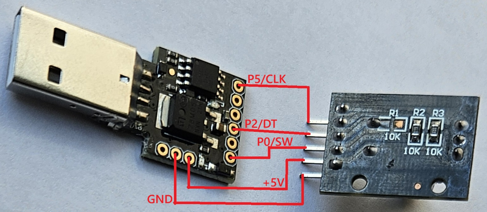

# ATtiny85 HID Rotary Knob

Turn a Digispark ATtiny85 USB dongle into a USB volume control knob for PCs.

Rotate the knob to adjust volume, press to mute. Works as a standard USB HID
Consumer Control device - no drivers needed on any OS.


## Hardware Required

- [Digispark ATtiny85 USB development board](http://digistump.com/products/1)
- [KY-040 Rotary Encoder module](https://www.amazon.de/-/en/AZDelivery-KY-040-Encoder-Compatible-Arduino/dp/B07CMSHWV6)


## Wiring



```
                     +-\/-+
ENC_A (CLK)    PB5  1|    |8  Vcc
USB D-         PB3  2|    |7  PB2    ENC_B (DT)
USB D+         PB4  3|    |6  PB1
               GND  4|    |5  PB0    ENC_SW (SW)
                     +----+
```

| Rotary Encoder | Digispark ATtiny85 |
|----------------|:------------------:|
| CLK            | P5                 |
| DT             | P2                 |
| SW             | P0                 |
| +              | 5V                 |
| GND            | GND                |

## Building

### Prerequisites

```bash
sudo apt install gcc-avr avr-libc binutils-avr libusb-1.0-0-dev pkg-config
```

### Build everything

```bash
make all
```

This builds:
- `main.hex` - ATtiny85 firmware (also copied to `hex/attiny85-volume-control-hid.hex`)
- `tools/micronucleus/micronucleus` - USB uploader tool for Digispark boards

To build only the firmware: `make hex`
To build only the uploader: `make micronucleus`

## Flashing

### Option A: Micronucleus (for boards with bootloader)

Build and flash in one step:

```bash
make upload
# Plug in Digispark when prompted
```

Rotate or press the knob to control your PC's volume.

### Option B: ISP Programmer (avrdude + usbasp)

```bash
make flash               # flash firmware only
make fuse                # program fuse bits (see warning below)
make program             # flash firmware + fuse bits
```

**Warning:** `make fuse` programs RSTDISBL, which disables the RESET pin on PB5
(required for the encoder CLK line). After this, ISP programming no longer works —
a high-voltage programmer is needed to recover. Digispark boards already ship with
this fuse set, so `make fuse` is only needed for bare ATtiny85 chips.

Override the programmer if needed:
```bash
make flash PROGRAMMER="-c usbasp"
```

## Troubleshooting

**Windows shows "USB device not recognized" on plug-in, but device works after a few seconds:**
This is normal. The micronucleus bootloader enumerates as a separate USB device for ~2 seconds
on every plug-in (waiting for a firmware upload command). Some USB 3.x host controllers
(especially on Windows 11) fail to recognize this brief bootloader device and show an error.
Once the bootloader times out and hands off to the volume control firmware, the device
re-enumerates and works correctly. The error message is harmless and can be dismissed.

**Linux `dmesg` shows `device descriptor read/64, error -71`:**
1. Re-flash the micronucleus bootloader via ISP:
   ```bash
   sudo avrdude -c usbasp -p t85 \
     -U flash:w:upgrade-t85_default.hex \
     -U lfuse:w:0xe1:m -U hfuse:w:0x5d:m -U efuse:w:0xfe:m
   ```
2. Then retry the micronucleus flashing steps above.

## Credits

Based on [tinyKnob](https://github.com/wagiminator/ATtiny85-TinyKnob) by Stefan Wagner (2020).
Uses the [V-USB](https://www.obdev.at/products/vusb/) software USB stack.

## License

See [LICENSE](LICENSE) for details.

- Firmware source (`src/`): [CC BY-SA 3.0](http://creativecommons.org/licenses/by-sa/3.0/)
- V-USB library (`usbdrv/`): GNU GPL v2 / v3 (see `usbdrv/License.txt`)
- Micronucleus uploader (`tools/micronucleus/`): GNU GPL v2
